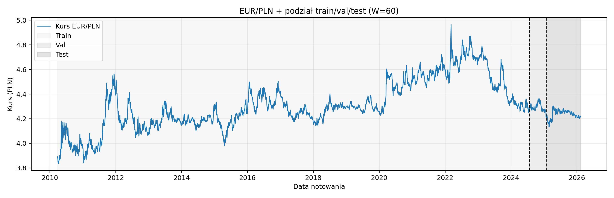
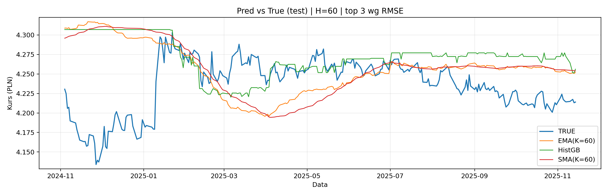
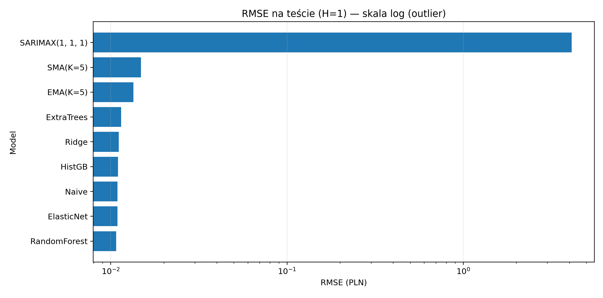
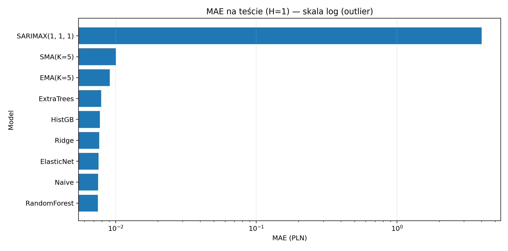
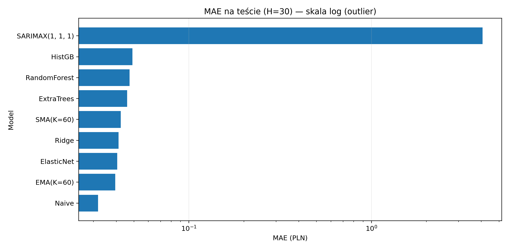

# 💱 EUR/PLN Forecasting — NBP Time-Series Benchmark

**Currency time-series forecasting in Python** using **NBP (Narodowy Bank Polski) API**.  
The project builds a **fair benchmark**: the same input window (**W=60**) and the same feature set for all ML models, evaluated on **time-based splits** for multiple horizons (**H = 1, 7, 30, 60**).

 **Pipeline:** fetch → dataset → train/eval → plots  
📊 **Outputs:** `runs/<timestamp>/` (metrics, predictions, plots, logs) + `data/` (datasets)

---

## 🎯 Goal

This project focuses on:
- forecasting **EUR/PLN** for the next NBP quotation (**business days**, not calendar days),
- handling **missing calendar days** (weekends/holidays) and reporting how many are missing,
- comparing **baselines vs ML vs classical time-series (SARIMAX)** in a **fair setup**,
- selecting the best model per horizon using **RMSE / MAE** (and optional direction accuracy for H=1).

---

## 🧠 Models

### ✅ Baselines (must-have)
- **Naive / Persistence:**  ŷ(t+H) = y(t)
- **SMA(K):** simple moving average from last K lags (K tuned on validation)
- **EMA(K):** exponential moving average from last K lags (K tuned on validation)

### 🤖 ML models (tabular features, sklearn)
- **Ridge Regression** (stable with many correlated lags)
- **ElasticNet** (L1/L2 mix, can reduce useless features)
- **RandomForestRegressor** (non-linearities, robust)
- **ExtraTreesRegressor** (often strong + fast on tabular data)
- **HistGradientBoostingRegressor** (boosted trees, usually top-tier)

### 🕰️ Classical time-series
- **SARIMAX (ARIMA)** — evaluated in a “fair” way: refit using only the last **W** observations for each prediction.

> **Why you might not “see SARIMAX” in plots:**  
> `pred_vs_true_top3_*.png` shows only **top-3 models by RMSE**, so weak models won’t appear there.  
> SARIMAX is always included in `metrics.csv` and `predictions.csv`.

---

## ⚙️ Experiment setup

- **Window:** W = 60 last quotations (lags `lag_0 ... lag_59`)
- **Horizons:** H = 1, 7, 30, 60
- **Features:** level lags + returns/changes + rolling mean/std + EMA
- **Split:** time-ordered `train / val / test` (no shuffling)
- **Tuning:** `TimeSeriesSplit` + `RandomizedSearchCV` (same rules for all ML models)
- **Metrics:** MAE, RMSE, MAPE, SMAPE (+ Directional Accuracy for H=1)

---

## 📂 Repository structure

```text
.
├─ configs/
│  └─ config.json
├─ data/
│  ├─ raw_eurpln_<start>_<end>.csv
│  ├─ ds_H1.csv
│  ├─ ds_H7.csv
│  ├─ ds_H30.csv
│  └─ ds_H60.csv
├─ runs/
│  └─ <timestamp>/
│     ├─ config.json
│     ├─ raw_eurpln.csv
│     ├─ missing_days.json
│     ├─ missing_dates.csv
│     ├─ datasets_manifest.json
│     ├─ metrics.csv
│     ├─ predictions.csv
│     ├─ best_baselines.json
│     ├─ best_ml_params.json
│     ├─ run.log
│     └─ plots/
│        ├─ series_split.png
│        ├─ rmse_test_H1.png
│        ├─ pred_vs_true_top3_H1.png
│        ├─ err_hist_best_H1_<MODEL>.png
│        └─ ...
├─ run_experiment.py
└─ src/
   ├─ data_fetch.py
   ├─ build_dataset.py
   ├─ train_eval.py
   └─ make_plots.py
```

---
## ▶️ Running the project
1) Install
```bash
python --version
# tested on Python 3.12

python -m venv .venv
# Windows:
.venv\Scripts\activate
# Linux/Mac:
# source .venv/bin/activate

pip install -r requirements.txt
```
2) Run the full pipeline (recommended)
```
python run_experiment.py
```
3) Run step-by-step (optional)
```
python -m src.data_fetch
python -m src.build_dataset
python -m src.train_eval
python -m src.make_plots
```

---
## Outputs
The project produces:
* missing-day report (weekends/holidays)
  * missing_days.json + missing_dates.csv
* datasets per horizon: data/ds_H*.csv
* benchmark results: metrics.csv, predictions.csv
* best configs: best_baselines.json, best_ml_params.json
* plots:
  * series with split boundaries,
  * RMSE/MAE comparisons per horizon,
  * prediction vs true for top models,
  * error histogram + error over time for the best model.
    
---
## Quick preview

<!-- Series + split -->
<table>
  <tr>
    <td align="center"><b>Series split (full)</b></td>
    <td align="center"><b>Series split (zoom)</b></td>
  </tr>
  <tr>
    <td></td>
    <td></td>
  </tr>
</table>

<!-- Pred vs True -->
<table>
  <tr>
    <td align="center"><b>Pred vs True (H=1)</b></td>
    <td align="center"><b>Pred vs True (H=7)</b></td>
  </tr>
  <tr>
    <td></td>
    <td></td>
  </tr>
  <tr>
    <td align="center"><b>Pred vs True (H=30)</b></td>
    <td align="center"><b>Pred vs True (H=60)</b></td>
  </tr>
  <tr>
    <td></td>
    <td></td>
  </tr>
</table>

<!-- Metrics -->
<table>
  <tr>
    <td align="center"><b>RMSE on Test (H=1)</b></td>
    <td align="center"><b>RMSE on Test (H=30)</b></td>
  </tr>
  <tr>
    <td></td>
    <td></td>
  </tr>
  <tr>
    <td align="center"><b>MAE on Test (H=1)</b></td>
    <td align="center"><b>MAE on Test (H=30)</b></td>
  </tr>
  <tr>
    <td></td>
    <td></td>
  </tr>
</table>

<!-- Errors (best per H) -->
<table>
  <tr>
    <td align="center"><b>Error histogram (best H=1)</b></td>
    <td align="center"><b>Error over time (best H=1)</b></td>
  </tr>
  <tr>
    <td></td>
    <td></td>
  </tr>
</table>

---
## 📌 Notes
* NBP quotations do not appear on weekends/holidays → the model forecasts the next available quotation.
* If SARIMAX is slow: it is fitted many times (rolling “fair fit”), so it can be computationally heavy.

---
### 🧑‍💻 Author

Created by Avuii
